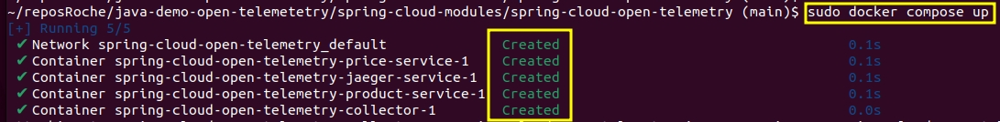
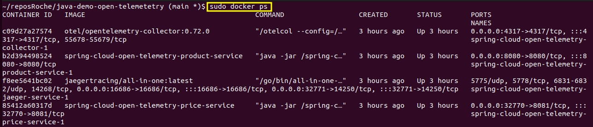
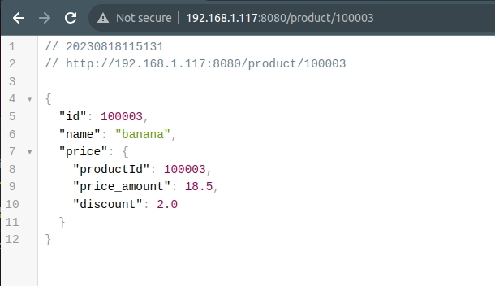
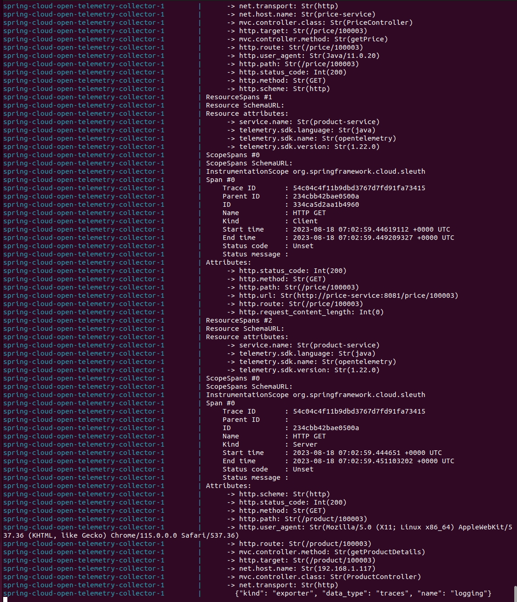
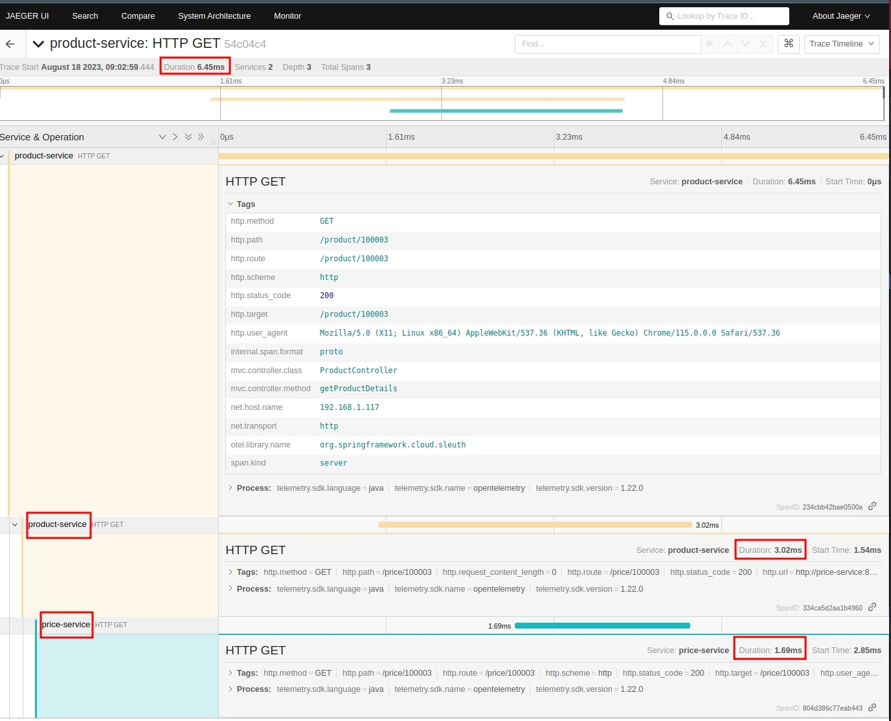
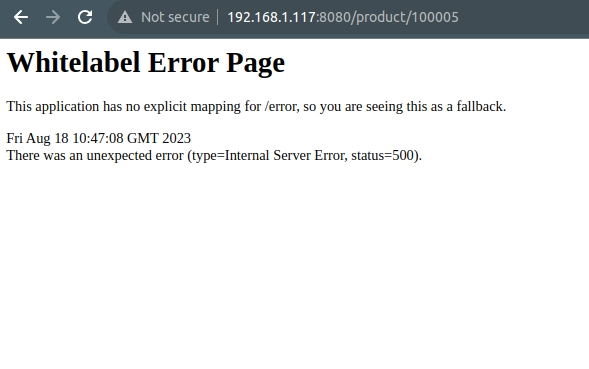
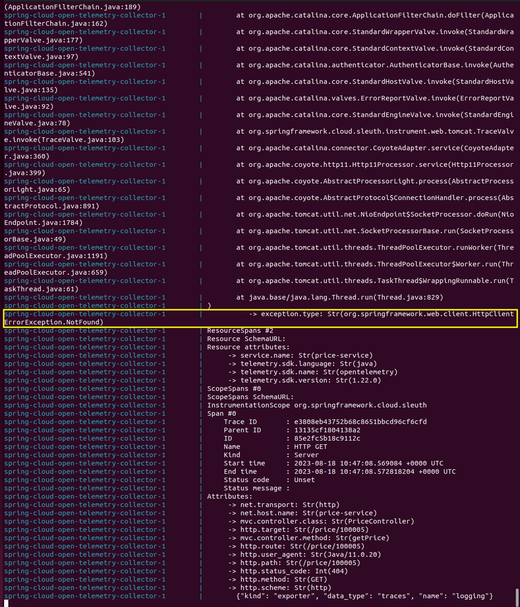
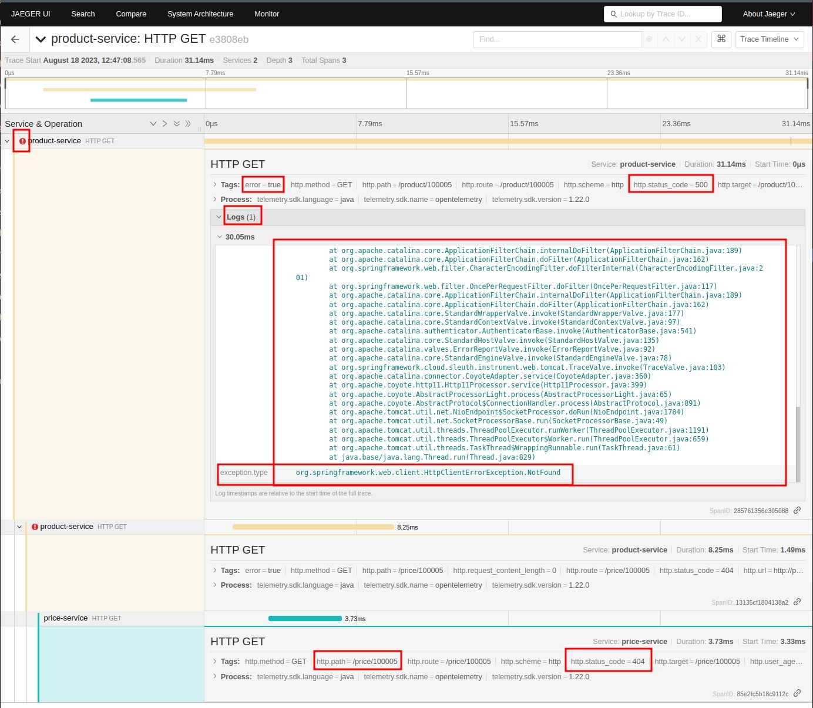

# java-demo-opentelemetry

* OpenTelemetry Setup in Spring Boot Application

In a distributed system, it's expected that occasional errors are bound to happen when serving requests. A central 
observability platform helps by capturing application traces/logs and provides an interface to query for a specific 
request. OpenTelemetry helps in standardizing the process of capturing and exporting telemetry data.

In this demo, we’ll learn how to integrate a Spring Boot Application with OpenTelemetry. Also, we’ll configure 
[OpenTelemetry](https://opentelemetry.io/) to capture application traces and send them to a central system to monitor 
the requests.

First, let’s understand a few basic concepts.

OpenTelemetry (Otel) is a collection of standardized vendor-agnostic tools, APIs, and SDKs. It's a [CNCF](https://www.cncf.io/) 
incubating project and is a merger of the OpenTracing and OpenCensus projects.

OpenTracing is a vendor-neutral API for sending telemetry data over to an observability backend. 
The OpenCensus project provides a set of language-specific libraries that developers can use to instrument their code 
and send it to any supported backends. <br/>
Otel uses the same concept of trace and span to represent the request flow across microservices as used by its 
predecessor projects.
<br/>

OpenTelemetry allows us to instrument, generate, and collect telemetry data, which helps in analyzing application behavior 
or performance. Telemetry data can include logs, metrics, and traces. We can either automatically or manually instrument 
the code for HTTP, DB calls, and more.
<br/>
Using the Otel SDK, we can easily override or add more attributes to the trace.
<br/>

* Example Application

Let's imagine we need to build two microservices, where one service interacts with the other. For instrumenting the 
application for telemetry data, we'll integrate the application with Spring and OpenTelemetry.

* Maven Dependencies

The [spring-cloud-starter-sleuth](https://central.sonatype.com/search?q=spring-cloud-starter-sleuth&namespace=org.springframework.cloud), 
[spring-cloud-sleuth-otel-autoconfigure](https://central.sonatype.com/search?q=spring-cloud-sleuth-otel-autoconfigure&namespace=org.springframework.cloud), 
and [opentelemetry-exporter-otlp](https://central.sonatype.com/search?q=opentelemetry-exporter-otlp&namespace=io.opentelemetry) 
dependencies **will automatically capture and export traces to any supported collector**.

First, we'll start by creating a Spring Boot Web project and include the below Spring and OpenTelemetry dependencies into 
both applications:

```bazaar
<dependency>
    <groupId>org.springframework.boot</groupId>
    <artifactId>spring-boot-starter-web</artifactId>
</dependency>
<dependency>
    <groupId>org.springframework.cloud</groupId>
    <artifactId>spring-cloud-starter-sleuth</artifactId>
    <exclusions>
        <exclusion>
            <groupId>org.springframework.cloud</groupId>
            <artifactId>spring-cloud-sleuth-brave</artifactId>
        </exclusion>
   </exclusions>
</dependency>
<dependency>
    <groupId>org.springframework.cloud</groupId>
    <artifactId>spring-cloud-sleuth-otel-autoconfigure</artifactId>
</dependency>
<dependency>
    <groupId>io.opentelemetry</groupId>
    <artifactId>opentelemetry-exporter-otlp</artifactId>
    <version>1.23.1</version>
</dependency>
```
We've excluded the Spring Cloud Brave dependency for replacing the default tracing implementation with Otel.
<br/>

Also, we'll need to include the Spring Dependency management BOM ([Bill Of Materials](http://djl.ai/bom/)) for Spring Cloud Sleuth:

```bazaar
<dependencyManagement>
    <dependencies>
        <dependency>
            <groupId>org.springframework.cloud</groupId>
            <artifactId>spring-cloud-dependencies</artifactId>
            <version>2021.0.5</version>
            <type>pom</type>
            <scope>import</scope>
        </dependency>
        <dependency>
            <groupId>org.springframework.cloud</groupId>
            <artifactId>spring-cloud-sleuth-otel-dependencies</artifactId>
            <version>1.1.2</version>
            <scope>import</scope>
            <type>pom</type>
        </dependency>
    </dependencies>
</dependencyManagement>
```

* Implement the Downstream Application

Our downstream application will have an endpoint to return Price data.

First, let's model the Price class:

```bazaar
public class Price {
    private long productId;
    private double priceAmount;
    private double discount;
}
```

Next, let's implement the PriceController with the Get Price endpoint:

```bazaar
@RestController(value = "/price")
public class PriceController {

    private static final Logger LOGGER = LoggerFactory.getLogger(PriceController.class);

    @Autowired
    private PriceRepository priceRepository;

    @GetMapping(path = "/{id}")
    public Price getPrice(@PathVariable("id") long productId) {
        LOGGER.info("Getting Price details for Product Id {}", productId);
        return priceRepository.getPrice(productId);
    }
}
```

Then, we'll implement the getPrice method in PriceRepository:

```bazaar
public Price getPrice(Long productId){
    LOGGER.info("Getting Price from Price Repo With Product Id {}", productId);
    if(!priceMap.containsKey(productId)){
        LOGGER.error("Price Not Found for Product Id {}", productId);
        throw new PriceNotFoundException("Price Not Found");
    }
    return priceMap.get(productId);
}
```

* Implement the Upstream Application

The upstream application will also have an endpoint to get the Product details and integrate with the above Get Price endpoint.
<br/>

First, let's implement the Product class:

```bazaar
public class Product {
    private long id;
    private String name;
    private Price price;
}
```

Then, let's implement the ProductController class with an endpoint for getting products:

```bazaar
@RestController
public class ProductController {

    private static final Logger LOGGER = LoggerFactory.getLogger(ProductController.class);

    @Autowired
    private PriceClient priceClient;

    @Autowired
    private ProductRepository productRepository;

    @GetMapping(path = "/product/{id}")
    public Product getProductDetails(@PathVariable("id") long productId){
        LOGGER.info("Getting Product and Price Details with Product Id {}", productId);
        Product product = productRepository.getProduct(productId);
        product.setPrice(priceClient.getPrice(productId));
        return product;
    }
}
```

Next, we'll implement the getProduct method in the ProductRepository:

```bazaar
public Product getProduct(Long productId){
    LOGGER.info("Getting Product from Product Repo With Product Id {}", productId);
    if(!productMap.containsKey(productId)){
        LOGGER.error("Product Not Found for Product Id {}", productId);
        throw new ProductNotFoundException("Product Not Found");
    }
    return productMap.get(productId);
}
```

Finally, let's implement the getPrice method in PriceClient:

```bazaar
public Price getPrice(@PathVariable("id") long productId){
    LOGGER.info("Fetching Price Details With Product Id {}", productId);
    String url = String.format("%s/price/%d", baseUrl, productId);
    ResponseEntity<Price> price = restTemplate.getForEntity(url, Price.class);
    return price.getBody();
}
```

* Configure Spring Boot With OpenTelemetry

OpenTelemetry provides a collector known as an Otel collector that processes and exports the telemetry data to any observability 
backends like Jaeger, Prometheus, and others.
<br/>

The traces can be exported to an Otel collector using a few Spring Sleuth configurations.

* Configure Spring Sleuth

We'll need to configure the application with the Otel endpoint to send telemetry data.
<br/>

Let's include the Spring Sleuth configuration in application.properties:

```bazaar
spring.sleuth.otel.config.trace-id-ratio-based=1.0
spring.sleuth.otel.exporter.otlp.endpoint=http://collector:4317
```

The trace-id-ratio-based property defines the sampling ratio for the spans collected. The value 1.0 means that all spans 
will be exported.

* Configure OpenTelemetry Collector

The Otel collector is the engine of OpenTelemetry tracing. It consists of receivers, processors, and exporters components. <br/<
There's an optional extension component that helps in the health check, service discovery, or data forwarding. 
The extension component doesn't involve processing telemetry data.
<br/>

To quickly bootstrap Otel services, we'll use the Jaeger backend endpoint hosted at port 14250.
<br/>

Let's configure the otel-config.yml with the Otel pipeline stages:

```bazaar
receivers:
  otlp:
    protocols:
      grpc:
      http:

processors:
  batch:

exporters:
  logging:
    loglevel: debug
  jaeger:
    endpoint: jaeger-service:14250
    tls:
      insecure: true

service:
  pipelines:
    traces:
      receivers:  [ otlp ]
      processors: [ batch ]
      exporters:  [ logging, jaeger ]
```

We should note that the above processors configuration is optional and, by default, is not enabled. <br/>
The processors batch option helps better compress the data and reduce the number of outgoing connections required to 
transmit the data.

* Run the Application

We'll now configure and run the entire setup, the applications, and the Otel collector.

* Build the parents (BOM Dependency management)

from the root folder of the application execute:

```bazaar
mvn clean install -Pparents
```

We'll build the services from de docker-compose file, so it is not necessary to use run ````mvn clean install```` for them. 

*  Configure Dockerfile in the Application

Let's implement the Dockerfile for our Product Service:

```bazaar
FROM adoptopenjdk/openjdk11:alpine
COPY target/spring-cloud-open-telemetry1-1.0.0-SNAPSHOT.jar spring-cloud-open-telemetry.jar
EXPOSE 8080
ENTRYPOINT ["java","-jar","/spring-cloud-open-telemetry.jar"]
```

```bazaar
FROM adoptopenjdk/openjdk11:alpine
COPY target/spring-cloud-open-telemetry2-1.0.0-SNAPSHOT.jar spring-cloud-open-telemetry.jar
EXPOSE 8081
ENTRYPOINT ["java","-jar","/spring-cloud-open-telemetry.jar"]
```

* Configure Services With Docker Compose

Now, let's configure the docker-compose.yml with the entire setup:

```bazaar
version: "4.0"

services:
  product-service:
    build: spring-cloud-open-telemetry1/
    ports:
      - "8080:8080"

  price-service:
    build: spring-cloud-open-telemetry2/
    ports:
      - "8081"

  collector:
    image: otel/opentelemetry-collector:0.72.0
    command: [ "--config=/etc/otel-collector-config.yml" ]
    volumes:
      - ./otel-config.yml:/etc/otel-collector-config.yml
    ports:
      - "4317:4317"
    depends_on:
      - jaeger-service

  jaeger-service:
    image: jaegertracing/all-in-one:latest
    ports:
      - "16686:16686"
      - "14250"
```

* Run the services via docker-compose:

Execute this command to run the services:

```bazaar
docker compose up
```


If you need to stop the services run this command:

```bazaar
docker compose down
```

Let's verify the services' status using the docker container command:

```bazaar
docker compose ps
```



* Let's generate Traces

Telemetry collector tools like Jaeger provide front-end applications to monitor the requests. We can view the request 
traces in real-time or later on.
<br/>
We can open the browser and call the product endpoint http://localhost:8080/product/100003 <br/>
This is what we can see in the browser after the call:


<br/>

And here we can see OTLP Collector doing its work:



Spring Sleuth will automatically configure the ProductService to attach the trace id to the current thread and as an HTTP 
Header to the downstream API calls. <br/>The PriceService will also automatically include the same trace id in the thread 
context and logs. <br/>The Otel service will use this trace id to determine the request flow across the services.
<br/>

Let's see the trace in our backend, in this case Jaeger, but it can be whatever backend that we prefer, the only thing 
to do on our side is in the otel-config.yml file to change the exporter jaeger to Tempo, Loki, SigNoz, DataDog, etc. etc. 
That's the real power of OpenTelemetry, we are agnostic of the final backend for metrics, traces and logs visualization.
<br/>

Let's open Jaeger in our browser visiting the url http://localhost:16686



We can see the metric of the trace and its spans, that is the time that the request and its spans took and also,  we can 
see the spans' endpoints that the original trace originated.

* Monitor Traces when the request fails

Imagine a scenario where the downstream service throws an exception, which results in a request failure.

Let's test the above scenario with the Product endpoint /product/100005 call where the Product is not present in the 
downstream application (we have productsID from 100001 to 100004).

This is what we see in the browser:



We can see a crash in the application logs too:



And again, we'll leverage the same UI to analyze the root cause, http://localhost:16686.

Now, let's visualize the failed request log and spans:



As seen above, we can trace back the request to the final API call where the error has originated, a 404 error (page not found) 
in the call to the price-service.


